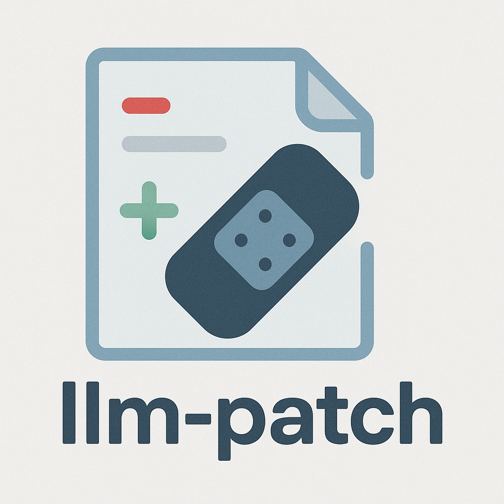

# llm-patch

<p align="center">
    
</p>

A robust, context-aware patching engine for applying unified diffs generated by Large Language Models (LLMs). Unlike traditional patch tools, llm-patch **ignores line numbers entirely** and instead uses fuzzy, context-driven matching to apply approximate or imperfect diffs reliably.

llm-patch focuses exclusively on one problem:  
**making LLM-generated patches apply correctly in real codebases.**

## Table of Contents

- [Why This Library Exists](#why-this-library-exists)
- [The Landscape of Approaches](#the-landscape-of-approaches)
- [Approach](#approach)
- [Grammar-Agnostic by Design](#grammar-agnostic-by-design)
- [Systematic Testing Methodology](#systematic-testing-methodology)
- [A Research Test Bed for Continuous Improvement](#a-research-test-bed-for-continuous-improvement)
- [Status](#status)
- [Installation](#installation)
- [Usage](#usage)
    - [Basic Usage](#basic-usage)
    - [Using PatchApplier Class](#using-patchapplier-class)
    - [Using FuzzyMatcher](#using-fuzzymatcher)
- [Development](#development)
    - [Running Tests](#running-tests)
    - [Running Linters](#running-linters)
    - [Pre-commit Hooks](#pre-commit-hooks)
- [Contributing](#contributing)
- [License](#license)
- [Acknowledgments](#acknowledgments)
- [Benchmark Dataset Quickstart](#benchmark-dataset-quickstart)
    - [Patch evaluation scoreboard](#patch-evaluation-scoreboard)

---

## Why This Library Exists

LLMs routinely generate unified diffs to describe code changes. While they are remarkably good at producing correct *content*, they are notoriously unreliable at producing:

- Correct **line numbers**
- Accurately matching **context blocks**
- Perfect alignment with **current file versions**
- Stable diffs across retries or refinement loops

Traditional tools (`patch`, `git apply`) assume diffs come from `diff` itself.  
They expect exact structure and precise numbering.  
LLM diffs rarely satisfy these constraints.

The result is a breakdown in agent pipelines:  
**valid fixes cannot be applied because the diff tool fails, not because the model is wrong.**

llm-patch solves this problem by applying diffs **the way an engineer would**—by analysing the textual changes and finding the best possible location for each hunk using robust contextual and fuzzy matching, not absolute coordinates.

---

## The Landscape of Approaches

A number of commercial and open-source tools have converged on similar ideas:

- **Aider** implements a fuzzy diff application mechanism to handle imperfect patches.
- **Cursor** integrates semantic code context when aligning LLM-produced edits.
- **GitHub Copilot Agents** internally use structural and AST-aware heuristics to resolve mismatched diffs.
- **Google's Diff Match Patch** provides approximate text matching, though it does not natively consume unified diffs.
- **AST-based frameworks** (Tree-sitter, Comby, etc.) provide structural transformations but are not directly aligned with the format LLMs naturally emit.

Across the industry, the problem is well-known, but **no standalone library** has been dedicated purely to:

- Taking LLM-generated unified diffs as input  
- Applying them **without relying on line numbers**  
- Using **repeatable, measurable fuzzy logic** to ensure robustness  
- Evaluating patching strategies against a **consistent, well-defined corpus** of test cases

llm-patch exists solely to fill that gap.

This is not a general-purpose diff tool.  
This is a **specialised engine designed only for LLM-driven patching workflows**.

---

## Approach

llm-patch implements a multi-stage hunk alignment algorithm:

1. **Parse unified diffs** into individual hunks.
2. **Ignore line numbers entirely**—they are treated only as weak hints.
3. For each hunk:
   - Perform **exact matching** of the removed lines.
   - If no match is found, perform **fuzzy matching** using similarity scoring.
   - Use contextual heuristics (before/after blocks) to identify the best location.
4. Apply additions and deletions at the highest-confidence match region.
5. Emit a patched file or return structured diagnostics when ambiguity exists.

This makes the library resilient against:

- Incorrect line numbers  
- Missing or loosely matching context  
- Whitespace or formatting drift  
- Edits to the file between attempts  
- Inconsistent or partial LLM retries

---

## Grammar-Agnostic by Design

llm-patch is intentionally **grammar agnostic**. It operates purely at the textual level and can be used with:

- any programming language,  
- markup formats,  
- configuration files,  
- or arbitrary plain text.

This ensures broad applicability across agent systems.

However, llm-patch recognises that **knowledge of a language’s grammar or structure can significantly improve resilience**.  
A future extension may support **pluggable grammar modules** or integration with syntactic/semantic analyzers (e.g., Tree-sitter, AST frameworks) to provide hybrid text+structure matching strategies.

The core engine remains lightweight and language-independent, while leaving room for targeted enhancement where domain knowledge helps.

---

## Systematic Testing Methodology

A core design goal of llm-patch is **repeatability** and **quantifiable robustness**.

The project includes a growing, **well-defined corpus of test cases** drawn from real-world LLM outputs. These test cases:

- originate from actual model responses (GPT, Claude, local models),  
- cover many failure modes observed in real agentic workflows,  
- are stored in a stable dataset for deterministic benchmarking.

llm-patch’s algorithms are evaluated by running against this corpus and measuring:

- whether the diff applies without error,  
- whether the resulting file matches the expected ground truth,  
- levels of fuzz required,  
- ambiguity resolution outcomes,  
- classification of failure types.

This produces a **quantitative, repeatable measure** of patching resilience.

Rather than relying on ad-hoc, anecdotal testing, llm-patch grounds all improvement in **systematic evaluation against a curated, reproducible suite**.

For a deep dive into how we will source, curate, and score hundreds of failing LLM diffs (including dataset layout, generator scripts, compiler gates, diff harvesting, and benchmark automation) read `docs/testing_strategy.md`. That document also covers the secret management expectations (via `.env` for keys like `OPENAI_API_KEY`), toolchain prerequisites, and the roadmap for the evaluation harness.

---

## A Research Test Bed for Continuous Improvement

The test bed is designed as a **living dataset** of real-world LLM behaviours.  
Its purpose is to:

- capture the evolving ways models generate diffs,  
- prevent regressions across algorithm revisions,  
- provide a consistent benchmark for comparing approaches,  
- and support empirical, data-driven development.

This avoids the pitfalls of:

- tuning against random samples,  
- overfitting to isolated examples,  
- or making unverifiable claims of robustness.

Every modification to llm-patch’s algorithm must demonstrate reproducible improvement across the entire corpus.

---

## Status

This project is in early development, with the core matching engine and benchmarking harness under active construction.  
Contributions, suggestions, and additional real-world test cases are welcome.

---

## Installation

```bash
pip install llm-patch
```

For development:

```bash
git clone https://github.com/trickl/llm-patch.git
cd llm-patch
pip install -e .
pip install -r requirements-dev.txt
```

## Usage

### Basic Usage

```python
from llm_patch import apply_patch

source_code = """
def hello():
    print("Hello, World!")
"""

patch = """
def hello():
    print("Hello, Universe!")
"""

result, success = apply_patch(source_code, patch)
if success:
    print("Patch applied successfully!")
    print(result)
else:
    print("Failed to apply patch")
```

### Using PatchApplier Class

```python
from llm_patch import PatchApplier

applier = PatchApplier(similarity_threshold=0.8)
result, success = applier.apply(source_code, patch)
```

### Using FuzzyMatcher

```python
from llm_patch import FuzzyMatcher

matcher = FuzzyMatcher(threshold=0.7)
source_lines = ["line1", "line2", "line3"]
pattern_lines = ["line1", "line2"]

# Find where the pattern best matches in the source
match_index = matcher.find_best_match(source_lines, pattern_lines)
if match_index is not None:
    print(f"Pattern found at line {match_index}")
```

## Development

### Running Tests

```bash
pytest tests/ -v --cov=llm_patch
```

### Running Linters

```bash
# Run pylint
pylint src/llm_patch

# Format code with black
black src/ tests/

# Type checking with mypy
mypy src/llm_patch
```

### Pre-commit Hooks

This project uses pre-commit hooks to ensure code quality:

```bash
pre-commit install
pre-commit run --all-files
```

## Contributing

Contributions are welcome! Please feel free to submit a Pull Request.

1. Fork the repository
2. Create your feature branch (`git checkout -b feature/amazing-feature`)
3. Run tests and linters (`pytest && pylint src/llm_patch`)
4. Commit your changes (`git commit -m 'Add some amazing feature'`)
5. Push to the branch (`git push origin feature/amazing-feature`)
6. Open a Pull Request

## License

This project is licensed under the MIT License - see the [LICENSE](LICENSE) file for details.

## Acknowledgments

- Inspired by the need to reliably apply LLM-generated code patches
- Built with modern Python best practices

---

## Benchmark Dataset Quickstart

- Problem catalog: start with the Expression Evaluator spec in `docs/test_cases.md`.
- Toolchains: install compilers/interpreters as listed in `docs/toolchains.md` (Java, C, Python, TypeScript, plus Ollama models `qwen2.5-coder:7b`, `llama3.2:3b`, and `phi3:mini`).
- Failure harvesting: run `python -m scripts.generate_failures --target-per-language 100` to collect non-compiling/incorrect samples (outputs land under `benchmarks/generated/<run_id>/...`).
- First-error diffs: run `python -m scripts.generate_patches --models qwen2.5-coder:7b,llama3.2:3b,phi3:mini` to ask the same models for minimal unified diffs that fix only the first compiler error in each case (diffs stored under each case’s `diffs/` folder).
- Patch evaluation: run `python -m scripts.run_patch_eval --algorithms git,diff-match-patch,aider` to apply every diff using the strict git pipeline, Google’s diff-match-patch, and the Aider-style matcher, then recompile the patched files and record per-attempt success metrics inside each case directory’s `results/` folder. Add `--markdown-report docs/patch_eval_results.md` (and optionally `--overwrite`) to emit a Markdown table that can be pasted directly into this README.

These artifacts feed the patching benchmarks described earlier so improvements can be measured quantitatively.

### Patch evaluation scoreboard

The evaluation harness now emits a Markdown table that breaks down each `problem_id × language` test suite and reports the three metrics requested per algorithm: how many diffs applied, how many of the applied diffs fixed the error, and the compound success rate over all attempts. Regenerate the report with:

```
python -m scripts.run_patch_eval --algorithms git,diff-match-patch,aider --markdown-report docs/patch_eval_results.md --log-level WARNING
```

The table is printed to stdout and saved to `docs/patch_eval_results.md` (ready for copy/paste). It now groups the metrics per algorithm and applies a red→green heatmap to make wins pop visually. The latest run was produced from commit `3222602`:

<!-- Auto-generated by scripts/run_patch_eval.py. Run with --markdown-report to refresh. -->

Results generated from commit `3222602` (3222602f238794d3f7d939f64b6fdd71a36c6e0c).

<table>
    <thead>
        <tr>
            <th rowspan="2">Test Suite</th>
            <th colspan="3">Git patch</th>
            <th colspan="3">diff-match-patch</th>
            <th colspan="3">Aider</th>
        </tr>
        <tr>
            <th>Applied %</th>
            <th>Fixed %</th>
            <th>Compound %</th>
            <th>Applied %</th>
            <th>Fixed %</th>
            <th>Compound %</th>
            <th>Applied %</th>
            <th>Fixed %</th>
            <th>Compound %</th>
        </tr>
    </thead>
    <tbody>
        <tr>
            <td><code>expr_eval_v1</code> · c</td>
            <td style="background-color:#eadddb; text-align:center; white-space:nowrap; font-family:var(--font-mono,monospace); "> 34.9% (104/298)</td>
            <td style="background-color:#f8d7da; text-align:center; white-space:nowrap; font-family:var(--font-mono,monospace); ">  0.0% (0/104)</td>
            <td style="background-color:#f8d7da; text-align:center; white-space:nowrap; font-family:var(--font-mono,monospace); ">  0.0% (0/298)</td>
            <td style="background-color:#eadddb; text-align:center; white-space:nowrap; font-family:var(--font-mono,monospace); "> 36.2% (108/298)</td>
            <td style="background-color:#f0dadb; text-align:center; white-space:nowrap; font-family:var(--font-mono,monospace); "> 19.4% (21/108)</td>
            <td style="background-color:#f5d8da; text-align:center; white-space:nowrap; font-family:var(--font-mono,monospace); ">  7.0% (21/298)</td>
            <td style="background-color:#d6e5dd; text-align:center; white-space:nowrap; font-family:var(--font-mono,monospace); "> 88.3% (263/298)</td>
            <td style="background-color:#f6d8da; text-align:center; white-space:nowrap; font-family:var(--font-mono,monospace); ">  5.7% (15/263)</td>
            <td style="background-color:#f6d8da; text-align:center; white-space:nowrap; font-family:var(--font-mono,monospace); ">  5.0% (15/298)</td>
        </tr>
        <tr>
            <td><code>expr_eval_v1</code> · java</td>
            <td style="background-color:#eadddb; text-align:center; white-space:nowrap; font-family:var(--font-mono,monospace); "> 35.4% (105/297)</td>
            <td style="background-color:#f7d7da; text-align:center; white-space:nowrap; font-family:var(--font-mono,monospace); ">  2.9% (3/105)</td>
            <td style="background-color:#f8d7da; text-align:center; white-space:nowrap; font-family:var(--font-mono,monospace); ">  1.0% (3/297)</td>
            <td style="background-color:#f2d9da; text-align:center; white-space:nowrap; font-family:var(--font-mono,monospace); "> 14.5% (43/297)</td>
            <td style="background-color:#ebdcdb; text-align:center; white-space:nowrap; font-family:var(--font-mono,monospace); "> 32.6% (14/43)</td>
            <td style="background-color:#f6d8da; text-align:center; white-space:nowrap; font-family:var(--font-mono,monospace); ">  4.7% (14/297)</td>
            <td style="background-color:#dae3dc; text-align:center; white-space:nowrap; font-family:var(--font-mono,monospace); "> 76.8% (228/297)</td>
            <td style="background-color:#f1dadb; text-align:center; white-space:nowrap; font-family:var(--font-mono,monospace); "> 18.9% (43/228)</td>
            <td style="background-color:#f2d9da; text-align:center; white-space:nowrap; font-family:var(--font-mono,monospace); "> 14.5% (43/297)</td>
        </tr>
        <tr>
            <td><code>expr_eval_v1</code> · python</td>
            <td style="background-color:#e9dddb; text-align:center; white-space:nowrap; font-family:var(--font-mono,monospace); "> 38.0% (115/303)</td>
            <td style="background-color:#f8d7da; text-align:center; white-space:nowrap; font-family:var(--font-mono,monospace); ">  0.9% (1/115)</td>
            <td style="background-color:#f8d7da; text-align:center; white-space:nowrap; font-family:var(--font-mono,monospace); ">  0.3% (1/303)</td>
            <td style="background-color:#e6dedb; text-align:center; white-space:nowrap; font-family:var(--font-mono,monospace); "> 46.5% (141/303)</td>
            <td style="background-color:#f5d8da; text-align:center; white-space:nowrap; font-family:var(--font-mono,monospace); ">  7.1% (10/141)</td>
            <td style="background-color:#f7d8da; text-align:center; white-space:nowrap; font-family:var(--font-mono,monospace); ">  3.3% (10/303)</td>
            <td style="background-color:#d5e5dd; text-align:center; white-space:nowrap; font-family:var(--font-mono,monospace); "> 90.1% (273/303)</td>
            <td style="background-color:#f4d8da; text-align:center; white-space:nowrap; font-family:var(--font-mono,monospace); ">  9.2% (25/273)</td>
            <td style="background-color:#f5d8da; text-align:center; white-space:nowrap; font-family:var(--font-mono,monospace); ">  8.3% (25/303)</td>
        </tr>
        <tr>
            <td><code>expr_eval_v1</code> · typescript</td>
            <td style="background-color:#e6dfdb; text-align:center; white-space:nowrap; font-family:var(--font-mono,monospace); "> 47.4% (143/302)</td>
            <td style="background-color:#f8d7da; text-align:center; white-space:nowrap; font-family:var(--font-mono,monospace); ">  0.0% (0/143)</td>
            <td style="background-color:#f8d7da; text-align:center; white-space:nowrap; font-family:var(--font-mono,monospace); ">  0.0% (0/302)</td>
            <td style="background-color:#f0dadb; text-align:center; white-space:nowrap; font-family:var(--font-mono,monospace); "> 20.9% (63/302)</td>
            <td style="background-color:#efdbdb; text-align:center; white-space:nowrap; font-family:var(--font-mono,monospace); "> 22.2% (14/63)</td>
            <td style="background-color:#f6d8da; text-align:center; white-space:nowrap; font-family:var(--font-mono,monospace); ">  4.6% (14/302)</td>
            <td style="background-color:#d5e5dd; text-align:center; white-space:nowrap; font-family:var(--font-mono,monospace); "> 88.7% (268/302)</td>
            <td style="background-color:#f2d9da; text-align:center; white-space:nowrap; font-family:var(--font-mono,monospace); "> 14.6% (39/268)</td>
            <td style="background-color:#f3d9da; text-align:center; white-space:nowrap; font-family:var(--font-mono,monospace); "> 12.9% (39/302)</td>
        </tr>
        <tr>
            <td><strong>Average</strong></td>
            <td style="background-color:#e9dddb; text-align:center; white-space:nowrap; font-family:var(--font-mono,monospace); "> 38.9% (467/1200)</td>
            <td style="background-color:#f8d7da; text-align:center; white-space:nowrap; font-family:var(--font-mono,monospace); ">  0.9% (4/467)</td>
            <td style="background-color:#f8d7da; text-align:center; white-space:nowrap; font-family:var(--font-mono,monospace); ">  0.3% (4/1200)</td>
            <td style="background-color:#ecdcdb; text-align:center; white-space:nowrap; font-family:var(--font-mono,monospace); "> 29.6% (355/1200)</td>
            <td style="background-color:#f2dada; text-align:center; white-space:nowrap; font-family:var(--font-mono,monospace); "> 16.6% (59/355)</td>
            <td style="background-color:#f6d8da; text-align:center; white-space:nowrap; font-family:var(--font-mono,monospace); ">  4.9% (59/1200)</td>
            <td style="background-color:#d6e5dd; text-align:center; white-space:nowrap; font-family:var(--font-mono,monospace); "> 86.0% (1032/1200)</td>
            <td style="background-color:#f3d9da; text-align:center; white-space:nowrap; font-family:var(--font-mono,monospace); "> 11.8% (122/1032)</td>
            <td style="background-color:#f4d9da; text-align:center; white-space:nowrap; font-family:var(--font-mono,monospace); "> 10.2% (122/1200)</td>
        </tr>
    </tbody>
</table>
